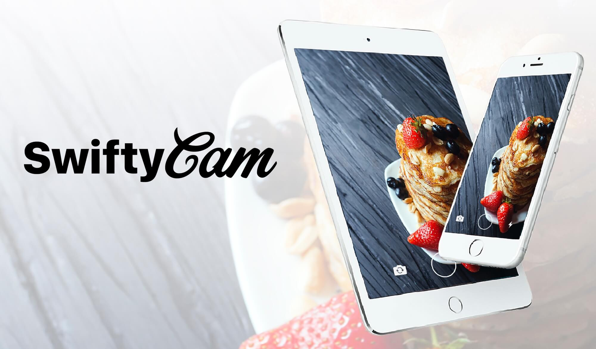

 

<p align="center">
    
    <a href="https://developer.apple.com/swift"></a>
    <a href="https://cocoapods.org/pods/SwiftyCam"></a>
     <br><br>
</p>

## Overview

SwiftyCam is a a simple, Snapchat-style iOS Camera framework for easy photo and video capture. SwiftyCam allows users to capture both photos and videos from the same session with very little configuration.

Configuring a Camera View Controller in AVFoundation can be tedious and time consuming. SwiftyCam is a drop in View Controller which gives complete control of the AVSession.

## Features

|                              | SwiftyCam        
| ------------------------------------- | --------------------- 
| :sunglasses:                  | Snapchat-style media capture               
| :+1:        					  | Support iOS8+                
| :camera:  						  | Image capture               
| :movie_camera:  			      | Video capture                
| :chart_with_upwards_trend:    | Manual image quality settings                
| :tada:                        | Front and rear camera support              
| :flashlight:                  | Front and rear flash  
| :sunny:                       | Retina flash support               
| :mag_right:                   |  Supports manual zoom               
| :lock:                        | Supports manual focus
| :last_quarter_moon_with_face: |  Low light setting               
| :speaker:                     | Background audio support                 
 


## Requirements

* iOS 8.0+
* Swift 3.0+

## License

SwiftyCam is available under the BSD license. See the LICENSE file for more info.


## Installation

### Cocoapods:

SwiftyCam is available through [CocoaPods](http://cocoapods.org). To install
it, simply add the following line to your Podfile:

```ruby
pod "SwiftyCam"
```

### [Carthage](https://github.com/Carthage/Carthage)

Add this to `Cartfile`

```
github "Awalz/SwiftyCam" ~> 2.2.1
```

```
$ carthage update SwiftyCam
```

### Manual Installation:

Simply copy the contents of the Source folder into your project.

## Usage

Using SwiftyCam is very simple.

### Prerequisites:

As of iOS 10, Apple requires the additon of the `NSCameraUsageDescription` and `NSMicrophoneUsageDescription` strings to the info.plist of your application. Example:

```xml
<key>NSCameraUsageDescription</key>
	<string>To Take Photos and Video</string>
<key>NSMicrophoneUsageDescription</key>
	<string>To Record Audio With Video</string>
```


### Getting Started:

If you install SwiftyCam from Cocoapods, be sure to import the module into your View Controller:

```swift
import SwiftyCam
```


SwiftyCam is a drop-in convenience framework. To create a Camera instance, create a new UIViewController subclass. Replace the UIViewController subclass declaration with `SwiftyCamViewController`:

```swift
class MyCameraViewController : SwiftyCamViewController
```

That is all that is required to setup the AVSession for photo and video capture. SwiftyCam will prompt the user for permission to use the camera/microphone, and configure both the device inputs and outputs.

## Capture

### SwiftyCamButton:

SwiftyCam comes with a very convenient method of capturing media. SwiftyCamButton captures photos with a `UITapGestureRecognizer` and captures video with a `UILongPressGestureRecognizer`

To use a SwiftyCamButton, simply create one and assign the delegate to your SwiftyCamViewController:

```swift
let captureButton = SwiftyCamButton(frame: buttonFrame)
captureButton.delegate = self
```

### Manual:

Capturing media with SwiftyCam is very simple. To capture a photo, simply call the `takePhoto` function:

```swift
takePhoto()
```    

Capturing Video is just as easy. To begin recording video, call the `startVideoRecording` function:

```swift
startVideoRecording()
``` 

To end the capture of a video, call the `stopVideoRecording` function:

```swift
stopVideoRecording()
``` 


### Delegate

In order to acquire the photos and videos taken by either the SwiftyCamButton or manually, you must implement the `SwiftyCamViewControllerDelegate` and set the `cameraDelegate` to your view controller instance:

```swift
class MyCameraViewController : SwiftyCamViewController, SwiftyCamViewControllerDelegate {
    
    override func viewDidLoad() {
        super.viewDidLoad()
        cameraDelegate = self
    }
    ...
}
```   

#### Delegate methods:

```swift
func swiftyCam(_ swiftyCam: SwiftyCamViewController, didTake photo: UIImage) {
     // Called when takePhoto() is called or if a SwiftyCamButton initiates a tap gesture
     // Returns a UIImage captured from the current session
}
    
func swiftyCam(_ swiftyCam: SwiftyCamViewController, didBeginRecordingVideo camera: SwiftyCamViewController.CameraSelection) {
     // Called when startVideoRecording() is called 
     // Called if a SwiftyCamButton begins a long press gesture
}
    
func swiftyCam(_ swiftyCam: SwiftyCamViewController, didFinishRecordingVideo camera: SwiftyCamViewController.CameraSelection) {
     // Called when stopVideoRecording() is called 
     // Called if a SwiftyCamButton ends a long press gesture
}
    
func swiftyCam(_ swiftyCam: SwiftyCamViewController, didFinishProcessVideoAt url: URL) {
     // Called when stopVideoRecording() is called and the video is finished processing
     // Returns a URL in the temporary directory where video is stored
}
    
func swiftyCam(_ swiftyCam: SwiftyCamViewController, didFocusAtPoint point: CGPoint) {
     // Called when a user initiates a tap gesture on the preview layer
     // Will only be called if tapToFocus = true
     // Returns a CGPoint of the tap location on the preview layer
}
    
func swiftyCam(_ swiftyCam: SwiftyCamViewController, didChangeZoomLevel zoom: CGFloat) {
	  // Called when a user initiates a pinch gesture on the preview layer
	  // Will only be called if pinchToZoomn = true
	  // Returns a CGFloat of the current zoom level
}
    
func swiftyCam(_ swiftyCam: SwiftyCamViewController, didSwitchCameras camera: SwiftyCamViewController.CameraSelection) {
     // Called when user switches between cameras
     // Returns current camera selection   
}
```   

## Flash

The flash(torch) can be enabled by changing the `flashEnabled` property:

```swift
flashEnabled = true
```   
    
Flash is now supported for front and rear facing cameras. 

### Rear Camera

For photos, the camera will flash much like the stock iOS camera. For video, the torch(flash) will enable for the duration of the video capture.

### Front Camera

For models that support [Retina Flash](https://developer.apple.com/library/content/documentation/DeviceInformation/Reference/iOSDeviceCompatibility/Cameras/Cameras.html#//apple_ref/doc/uid/TP40013599-CH107-SW7), the front camera will use the default flash for image capture. If Retina Flash is not supported, a faux Retina Flash is used similar to Snapchat.

For front facing videos, a white, 85% opaque view will be placed over the video feed for the duration of the video capture.

## Switching Camera

By default, SwiftyCam will launch to the rear facing camera. This can be changed by changing the `defaultCamera` property in `viewDidLoad`:

```swift
override func viewDidLoad() {
    super.viewDidLoad()
    defaultCamera = .front
    ...
}
```

SwiftyCam supports capture from both the front and back cameras. To switch cameras, call the function:

```swift
switchCamera()
```

Tap-to-focus, pinch-to-zoom and camera flash are not supported when the front facing camera is selected. *Switching video while video is being recorded is not currently supported*

SwiftyCam also enables switching between cameras with a double tap gesture. To disable this feature, use the `doubleTapCameraSwitch` property:

```swift
doubleTapCameraSwitch = false
```

## Configuration

SwiftyCam has several options for configurating the functionality of the capture:

### Video Quality

Video quality can be set by the **videoQuality** property of SwiftyCamViewController. The choices available correspond to the matching **AVCaptureSessionPreset**:

| VideoQuality                          | AVCaptureSessionPreset        
| ------------------------------------- | --------------------- 
| `.high`                           | **AVCapturePresetHigh**                
| `.medium`        					   | **AVCapturePresetMedium**                
| `.low`  							   | **AVCapturePresetLow**                
| `.resolution352x288`  			   | **AVCaptureSessionPreset352x288**                
| `.resolution640x480`              | **AVCaptureSessionPreset640x480**                
| `.resolution1280x720`             | **AVCaptureSessionPreset1280x720**              
| `.resolution1920x1080`            | **AVCaptureSessionPreset1920x1080**  
| `.resolution3840x2160`            | **AVCaptureSessionPreset3840x2160**               
| `.iframe960x540`                  | **AVCaptureSessionPresetiFrame960x540**               
| `.iframe1280x720`                 | **AVCaptureSessionPresetiFrame1280x720**               
            

The default value is **.high**. For use with the front-facing camera, **.high** will always be used.

### Maximum Video Duration

If using a SwiftyCamButton, you can set a maximum video duration for the length of video. The video recording will me automatically stopped once the time limit has been reached and the delegate method `SwiftyCamDidFinishRecordingVideo` will be called. To set this value, simply change the `maximumVideoDuration` value:

```swift
maximumVideoDuration = 10.0
```

A value of **0.0** will allow for unlimited video recording via the SwiftyCamButton. The default value is **0.0**.

## Camera Zoom

SwiftyCam supports digital zoom of the camera session via pinch gestures. The gestures work similar to the default iOS app and will zoom to the maximum supported zoom level. Camera zoom is only supported on the rear facing camera. AVFoundation does not currently support front facing camera zoom. To disable this feature, change the `pinchToZoom` property:

```swift
pinchToZoom = false
```   

By default, **pinchToZoom** is enabled.

You can also restrict the amount that the rear facing camera can zoom. To do this, use the         `maxZoomScale` property:

```swift
maxZoomScale = 2.0
```   

By default, `maxZoomScale` is set to **4.0**.

## Camera Focus

SwiftyCam, by default, support tap to focus on the video preview. SwiftyCam will set the focus and exposure levels of the session to the tapped point. While tap to set exposure is supported on both cameras, tap to focus is only supported on rear facing cameras. Autofocus and autoexposure will be resumed once SwiftyCam detects significant movement from the tapped point. To disable this feature, change the `tapToFocus` property:

```swift
tapToFocus = false
```

By default, `tapToFocus` is enabled. If you wish to show a on screen animation when a tap to focus is initiated, you can use the `SwiftyCamDidFocusAtPoint(focusPoint:)` to get the coordinates of tap and provide your own tap animation

## Device Orientation

By default, SwiftyCam will set the photo orientation to be portrait. If you wish to preserve the orientation of the capture photos to allow support for landscape images, use the `shouldUseDeviceOrientation` property:

```swift
shouldUseDeviceOrientation = true
```


## Background Audio

SwiftyCam has the ability to allow background audio to continue playing within the session, and to be captured by the video recording. By default, this is enabled. If you wish to disable this feature, change the `allowBackgroundAudio` property:

```swift
allowBackgroundAudio = false
```

## Low Light Boost

For supported models (iPhone 5 and 5C), AVCaptureDevice supports a low light boost when it is detected that the capture session is in a low light area. By default, this is set to true. It can be modified with the `lowLightBoost` variable:

```swift
lowLightBoost = false
```

## Privacy

When a user firsts launch SwiftyCamViewController, they will be prompted for permission for access to the cameras and microphones. By default, if a user declines access to the hardware, SwiftyCam will provide a prompt to the App privacy settings inside the iOS settings application. 

## Miscellaneous

Other properties:

* `isCameraFlashOn` -  **Boolean**
* `isVideoRecording` - **Boolean**
* `isSessionRunning` - **Boolean**
* `currentCamera` - **CameraSelection**


### Contact

If you have any questions, requests, or enhancements, feel free to submit a pull request, create an issue, or contact me in person:

**Andrew Walz**
**andrewjwalz@gmail.com**
